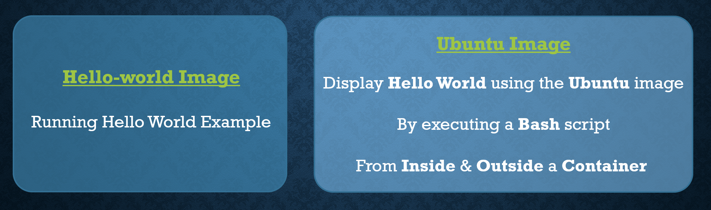

# DEMONSTRATION




## Example 1 - Hello World docker image


#### 1 - Download the Hello-world image

```
$ docker pull hello-world

```

#### 2 - Run a container using the Hello-world image

```
$ docker run hello-world
```

#### 3 - List currently running containers

```
$ docker ps
```

#### 4 - List all docker containers (running and stopped)

```
$ docker ps -a
```

## Example 2 - Ubuntu docker image

#### 1 - Download the Ubuntu image

```
$ docker pull ubuntu

```

#### 2 - Create and Run a container named ubuntu-hello & get into the bash terminal

```
$ docker run -it --name ubuntu-hello ubuntu
```

#### 3 - Create and execute a bash script inside the ubuntu container "ubuntu-hello"

```
$ apt update
$ apt install nano
$ nano hello.sh
$ echo Hello World
```
```
$ bash hello.sh
$ exit
```

#### 4 - Execute the bash script from outside using the container "ubuntu-hello"

##### - List all docker containers (running and stopped)

```
$ docker ps -a
```

##### - Start the existing container "ubuntu-hello" & check if it's running

```
$ docker start ubuntu-hello
$ docker ps
```

##### - Execute the bash script using the container "ubuntu-hello"

```
$ docker exec ubuntu-hello bash hello.sh
```

#### 5 - Remove the container named "ubuntu-hello"

```
$ docker rm ubuntu-hello
```

#### 6 - Delete the image ubuntu 

```
$ docker rmi ubuntu
```

